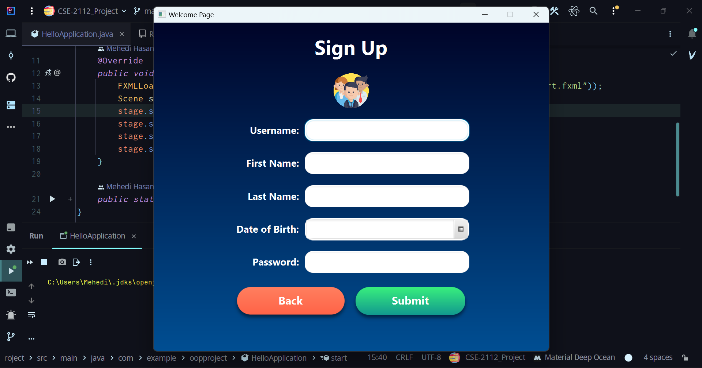
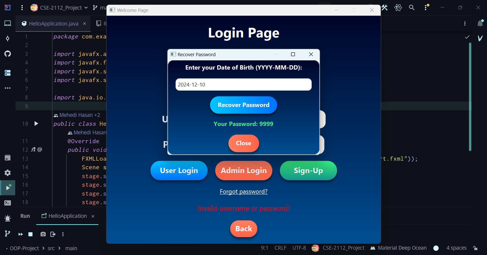
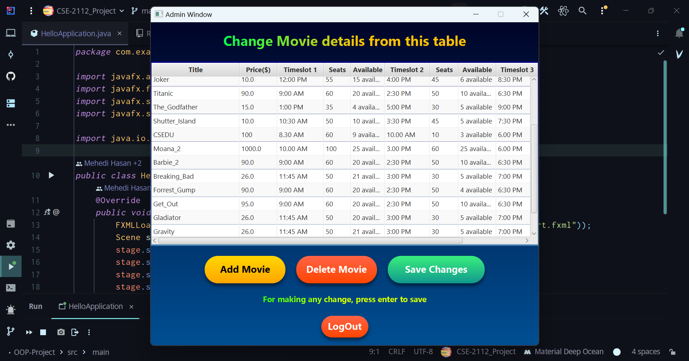
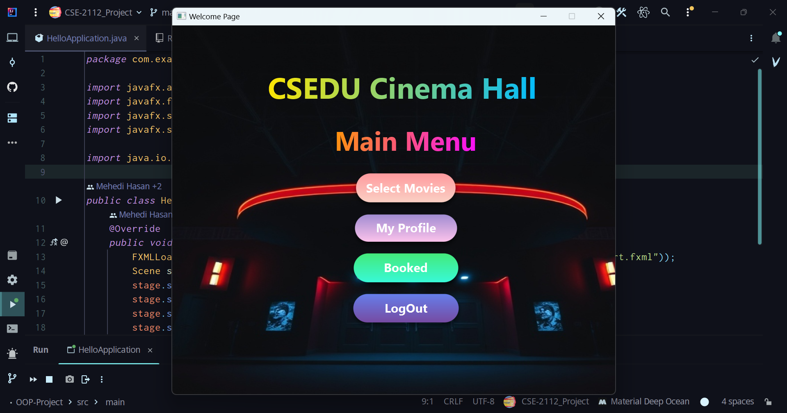
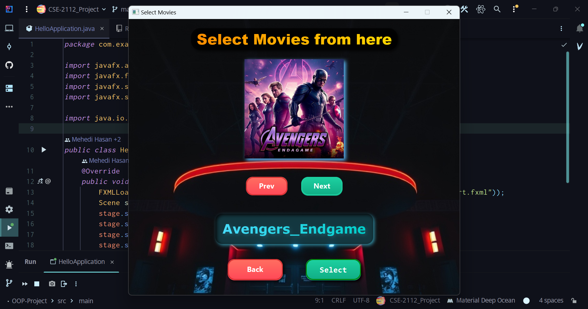

## JavaFX Movie Ticket Booker (CSE-2112-Project)

<p align="center">
  
  <br>
  <strong>JavaFX Movie Ticket Booking System</strong>
</p>

Welcome here **JavaFX Ticket Booking App**. This is a basic type Ticket Booker Desktop based GUI Application that provides a user to choice and select their movies for booking. There is both user and admin section. This is the 2nd Year 1st Semester Final Project for Object Oriented Programming (CSE-2112) Lab Course.

---

## Attachments

  - [Video](https://youtu.be/ogj0jgNRnBg?si=wpiWtzYInOiUOnK9)
  - [Report](Project_report.pdf)
  - [Slide](readmepic/Project_Slide.pptx)
  - [Installation Guide](Guide.pdf)

---

## ✨ Features

### 🎟️ User Features
- **Login-Signup**: User can login to his account or create one from `user_database.txt`.
- **Browse Movies**: View the list of movies available for booking.
- **View Details**: Check movie price, available seats, and timeslots.
- **Book Tickets**: Reserve your seat if available.
- **Check Profile**: Visit profile for look back the data and due(Update not possible)
- **Check Tickets**: Look back to the tickets that user have already booked.
- **Recover Password**: Recover the user id with date of birth in case of forget password

### 🛠️ Admin Features
- **Add Movies**: Add new movies with details like title, price, and timeslots.
- **Edit Details**: Modify seat availability, timeslot information, and more.
- **Remove Movies**: Delete movies directly from the database.
- **File Management**: Data is stored in `movie_database.txt`.

---

## 🔐 Admin Credentials
  - **Username:** admin123
  - **Password:** 1234

---

## **Screenshots 📸**

|  |  |
|:-------------------:|:------------------:|
| _Start Menu Screen._ | _Login Screen._ |

|  |  |
|:-------------------:|:------------------:|
| _Signup Screen._ | _Forget Password Screen._ |

|  |  |
|:-------------------:|:------------------:|
| _Admin Menu Screen._ | _Main Menu Screen._ |

|  |  |
|:-------------------:|:------------------:|
| _Movie Select Menu Screen._ | _Ticket Buying Screen._ |

--- 

## 🚀 Getting Started

### 🔧 Prerequisites
1. **Java Development Kit (JDK)**: Version 11 or higher. (23.0.2 Recommended)
2. **JavaFX SDK**: Ensure `javafx` modules are added. (23.0.2 Recommended)
3. **IDE**: IntelliJ IDEA, Eclipse, or NetBeans recommended. (Intellij IDEA Recommended)

---

### 📥 Installation
1. Clone the repository:
 ```bash
 git clone "https://www.github.com/hasanmehediii/CSE-2112-Project"
```
1. Open the project in your preferred IDE.
2. Add the JavaFX libraries to the build path.
3. Run the Main class (HelloApplication.java) to launch the application.

---

### 🔄 Git Workflow (for contribution)
1. Create a new branch for changes:
   ```bash
   git checkout -b feature-branch-name 
2. Make changes in your code and stage them:
   ```bash
   git add .
3. Commit the changes with a message:
   ```bash
   git commit -m "Describe the changes made"
4. Push the changes to GitHub:
   ```bash
   git push origin feature-branch-name
   
5. Create a pull request on GitHub:
   - Go to the repository on GitHub.
   - Click "Compare & pull request".
   - Add a title and description.
   - Click "Create pull request".
     
6. Switch to the main branch:
   ```bash
   git checkout main 
7. Pull the latest changes:
   ```bash
   git pull origin main 
8. Merge updates into your feature branch:
   ```bash
   git checkout feature-branch-name
   git merge main 
9. Push the updated feature branch:
    ```bash
    git push origin feature-branch-name 

    
---

## 📖 Usage

### For Users
1. Login to the app and browse movies.
2. Select a timeslot and check seat availability.
3. Book tickets if seats are available.
4. See the dashboard of user.
5. Check the already booked tickets.

### For Admins
1. Log in with admin credentials.
2. Add, edit, or remove movies as needed.
3. Save changes to update the `movie_database.txt` file.

---

## 🌟 Future Enhancements
- 🗄️ Database integration (e.g., MySQL) for scalable data management.
- 💳 Payment gateway integration for online ticket booking.
- 🎭 Graphical seat selection interface.

---

## 📬 Contact  

If you have any questions, feedback, or suggestions, feel free to reach out!  

## **Contributors 👤**  

### 👤 Mehedi Hasan  
- **Email**: [mehedi-2022415897@cs.du.ac.bd](mailto:mehedi-2022415897@cs.du.ac.bd)
- **GitHub**: [hasanmehediii](https://www.github.com/hasanmehediii)
- **Institution**: CSE, University of Dhaka 

### 👤 Ibna Afra Roza  
- **Email**: [ibnaafra-2022015891@cs.du.ac.bd](mailto:ibnaafra-2022015891@cs.du.ac.bd)
- **GitHub**: [Roza-fail](https://www.github.com/Roza-fail)
- **Institution**: CSE, University of Dhaka
