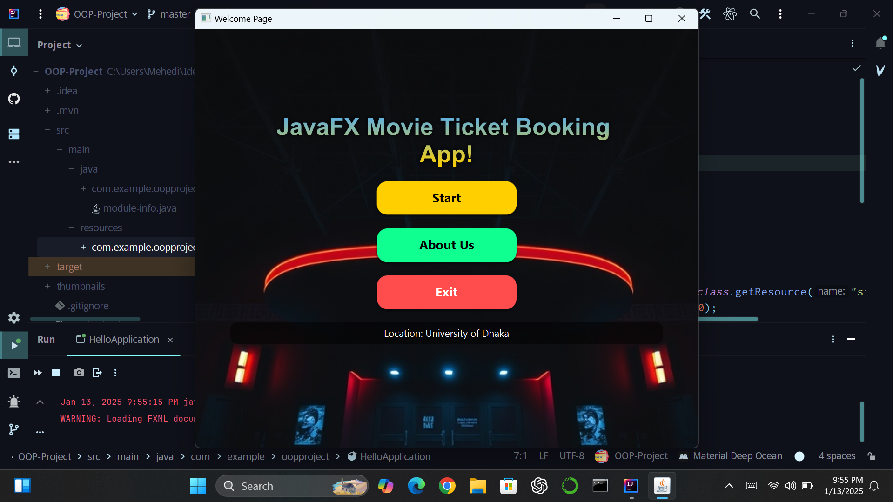
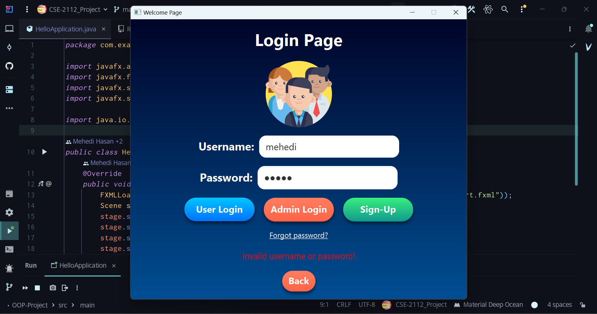
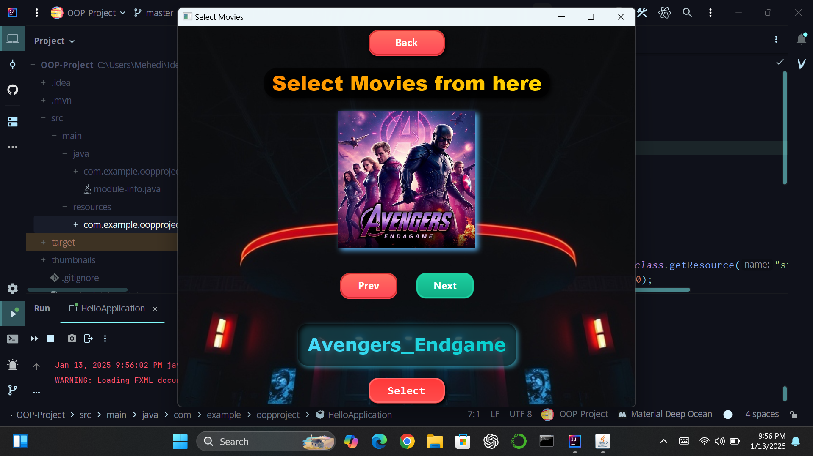
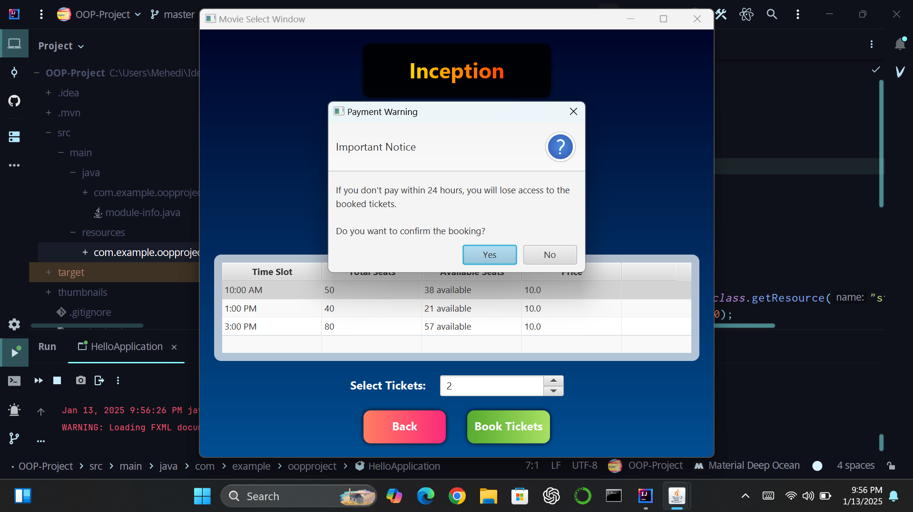

## JavaFX Movie Ticket Booker (CSE-2112-Project)

Welcome here **JavaFX Ticket Booking App**. This is a basic type Ticket Booker Desktop based GUI Application that provides a user to choice and select their movies for booking. There is both user and admin section. This is the 2nd Year 1st Semester Final Project for Object Oriented Programming (CSE-2112) Lab Course.

---

## Attachments

  - [Video](https://www.youtube.com/url_of_this_video)
  - [PDF](readmepic/Project.pdf)

---

## ✨ Features

### 🎟️ User Features
- **Login-Signup**: User can login to his account or create one from `user_database.txt`.
- **Browse Movies**: View the list of movies available for booking.
- **View Details**: Check movie price, available seats, and timeslots.
- **Book Tickets**: Reserve your seat if available.
- **Check Profile**: Visit profile for look back the data and due(Update not possible)
- **Check Tickets**: Look back to the tickets that user have already booked. 

### 🛠️ Admin Features
- **Add Movies**: Add new movies with details like title, price, and timeslots.
- **Edit Details**: Modify seat availability, timeslot information, and more.
- **Remove Movies**: Delete movies directly from the database.
- **File Management**: Data is stored in `movie_database.txt`.

---

## 🔐 Admin Credentials
  - **Username:** admin123
  - **Password:** 1234

---

## **Screenshots 📸**

  
_Start Menu Screen._

  
_Login Screen._

  
_Movie Select Menu Screen._

  
_Ticket Buying Screen._

--- 

## 🚀 Getting Started

### 🔧 Prerequisites
1. **Java Development Kit (JDK)**: Version 11 or higher.
2. **JavaFX SDK**: Ensure `javafx` modules are added.
3. **IDE**: IntelliJ IDEA, Eclipse, or NetBeans recommended.

---

### 📥 Installation
1. Clone the repository:
 ```bash
 git clone "https://www.github.com/hasan-mehedii/CSE-2112-Project"
```
1. Open the project in your preferred IDE.
2. Add the JavaFX libraries to the build path.
3. Run the Main class to launch the application.

---

## 📖 Usage

### For Users
1. Launch the app and browse movies.
2. Select a timeslot and check seat availability.
3. Book tickets if seats are available.

### For Admins
1. Log in with admin credentials.
2. Add, edit, or remove movies as needed.
3. Save changes to update the `movie_database.txt` file.

---

## 🌟 Future Enhancements
- 🗄️ Database integration (e.g., MySQL) for scalable data management.
- 💳 Payment gateway integration for online ticket booking.
- 🎭 Graphical seat selection interface.

---

## 📬 Contact  

If you have any questions, feedback, or suggestions, feel free to reach out!  

### 👤 Mehedi Hasan  
- **Email**: [mehedi-2022415897@cs.du.ac.bd](mailto:mehedi-2022415897@cs.du.ac.bd)
- **GitHub**: [hasan-mehedii](https://www.github.com/hasan-mehedii)
- **Institution**: CSE, University of Dhaka 

### 👤 Ibna Afra Roza  
- **Email**: [ibnaafra-2022015891@cs.du.ac.bd](mailto:ibnaafra-2022015891@cs.du.ac.bd)
- **GitHub**: [Roza-fail](https://www.github.com/Roza-fail)
- **Institution**: CSE, University of Dhaka 

